# SPRING FRAMEWORK

```java
/**
 * @// TODO: 14.04.2023  
 */
```

# Spring Core

*Spring Core - IoC, DI, Beans, Configuration (XML, Annotation and Java), Autowiring*

## Inversion of Control (IoC)

## Проблема #1:

### Сильная зависимость:

MusicPlayer сильно зависит от ClassicalMusic. <br/>
Класс MusicPlayer "заточен" на работу только с ClassicalMusic.

```java
class ClassicalMusic {
    // Code to access classical music 
}

class MusicPlayer {
    private ClassicalMusic classicalMusic;

    public void playMusic() {
        // Code to play classical music 
    }
}
```

## Решение:

Использовать интерфейс (или абстрактный класс),
который бы обобщал различные музыкальные жанры.

```java
interface Music {
    // The code that is needed to access any genre of music
}

class ClassicalMusic implements Music {
    // Code to access classical music
}

class RockMusic implements Music {
    // code to access rock music
}

class MusicPlayer {
    private Music music;

    public void playMusic() {
        music = new ClassicalMusic();
        // or
        music = new RockMusic();

        // Code to play music
    }
}
```

## Проблема #2:

### Слабая зависимость:

Объекты создаются вручную. Мы хотим вынести эти детали в конфигурационный файл,
а не лезть каждый раз в код (и перекомпилировать его) для того, чтобы поменять объект.

```java
interface Music {
    // The code that is needed to access any genre of music
}

class ClassicalMusic implements Music {
    // Code to access classical music
}

class RockMusic implements Music {
    // code to access rock music
}

class MusicPlayer {
    private Music music;

    public void playMusic() {
        music = new ClassicalMusic();
        // or
        music = new RockMusic();

        // Code to play music
    }
}
```

## Решение:

Использовать Spring Framework, который сам создаст необходимые объекты (бины)
согласно конфигурационному файлу.

## Bean

• Это просто Java-объект, который создаётся и управляется Spring Container. <br/>
• Когда Java-объекты создаются с помощью Spring'а, они называются бинами (beans). <br/>
• Бины создаются из Java-классов (так же, как и обычные объекты).

```xml
<bean>id="testBean"
    class="us.ossowitz.springcourse.TestBean">
    <constructor-arg value="Ilya"/>
</bean>
```

• id - идентификатор бина <br/>
• class - полное имя класса

## Проблема #3:

MusicPlayer сам создаёт свои зависимости. Это архитектурно неправильно - противоречит принципу IoC.

```java
interface Music {
    // The code that is needed to access any genre of music
}

class ClassicalMusic implements Music {
    // Code to access classical music
}

class RockMusic implements Music {
    // code to access rock music
}

class MusicPlayer {
    private Music music;

    public void playMusic() {
        music = new ClassicalMusic();
        // or
        music = new RockMusic();

        // Code to play music
    }
}
```

## Решение:

Использовать принцип IoC.

# Inversion of Control (IoC)

```java
interface Music {
    // The code that is needed to access any genre of music
}

class ClassicalMusic implements Music {
    // Code to access classical music
}

class RockMusic implements Music {
    // code to access rock music
}

class MusicPlayer {
    private Music music;

    public void playMusic() {
        music = new ClassicalMusic();
        // or
        music = new RockMusic();

        // Code to play music
    }
}
```

• MusicPlayer зависит от классов, реализующих интерфейс Music. <br/>
• MusicPlayer сам создаёт объект ClassicalMusic. <br/>
• Вместо этого мы хотим передавать объект ClassicalMusic внутрь
MusicPlayer - это и называется инверсией управления (IoC).

### Инверсия управления - это такой архитектурный подход, когда сущность не сама создаёт свои зависимости, а когда этой сущности зависимости поставляются извне.

## Последняя проблема

```java
class MusicPlayer {
    private Music music;

    // Зависимость внедряется извне (IoC)
    public MusicPlayer(Music music) {
        this.music = music;
    }

    public void playMusic() {
        // Больше не создаём объекты!

        // ... Код для воспроизведения музыки
    }
}
```

Объект, который мы хотим внедрить в MusicPlayer необходимо где-то создать.

```java
class UseMusicPlayer {
    public static void main(String[] args) {
        MusicPlayer musicPlayer = new MusicPlayer(new ClassicalMusic());
    }
}
```

**Эту проблему можно решить с помощью внедрения зависимостей (Dependency Injection).** <br/>
Этой задачей тоже занимается Spring Framework.

## Spring можно конфигурировать с помощью:

• XML-файла конфигураций (старый способ, но многие существующие приложения
до сих пор его используют). <br/>
• Java-аннотаций и немного XML (современный способ). <br/>
• Вся конфигурация на Java-коде (современный).

## Способы внедрения зависимостей

• Через конструктор. <br/>
• Через setter. <br/>
• Есть множество конфигураций того, как внедрять (scope, factory method и т.д.). <br/>
• Можно внедрять через XML, аннотации или Java-код. <br/>
• Процесс внедрения можно автоматизировать (Autowiring).

### Внедрение (Injection) с помощью конструктора

```xml
<bean id="musicBean"
      class="us.ossowitz.springcourse.ClassicalMusic">
</bean>

<bean id="musicPlayer"
      class="us.ossowitz.springcourse.MusicPlayer">
<constructor-arg ref="musicBean"/>
</bean>
```

### Использование

```java
MusicPlayer musicPlayer=context.getBean("musicPlayer",MusicPlayer.class);
musicPlayer.playMusic();
```

### Внедрение зависимостей через setter

```java
public void setMusic(Music music){
        this.music=music;
}
```

```xml
<bean id="musicPlayer"
      class="us.ossowitz.springcourse.MusicPlayer">
    <property name="music" ref="musicBean"/>
</bean>
```

### Внедрение простых значений

```java
private String name;
private int volume;

public void setName(String name){
        this.name=name;
}

public void setVolume(int volume){
        this.volume=volume;
}
```

```xml
<property name="name" value="Some name"/>
<property name="volume" value="50"/>
```

### Внедрение простых значений из внешнего файла

• Не хотим каждый раз лезть в applicationContext.xml <br/>
• Хотим все простые значения указать в одном файле.

1. Создаём файл, расширения .properties <br/>
   Содержимое: <br/>

```text
musicPlayer.name=Some name
musicPlayer.volume=70
```

2. В applicationContext.xml подтягиваем путь до файла musicPlayer.properties: <br/>

```xml
<context:property-placeholder location="classpath:musicPlayer.properties"/>
```

3. Внедряем зависимости: <br/>

```xml
<property name="name" value="${musicPlayer.name}"/>
<property name="volume" value="${musicPlayer.volume}"/>
```

## Scope

**Scope задаёт то, как Spring будет создавать ваши бины. <br/>
Определяет жизненный цикл бина и возможное количество создаваемых бинов.**

### Singleton

**Scope, который используется по умолчанию**

```xml
<bean id="musicBean"
      class="us.ossowitz.springcourse.MusicPlayer">
</bean>
```

• По умолчанию создаётся объект (он создаётся до вызова метода getBean()). <br/>
• При всех вызовах getBean() возвращается ссылка на один и тот же единственный объект. <br/>
• Подходит для stateless-объектов (объекты, состояние
которых нам менять не приходится. Потому что если мы будем изменять состояние
у Singleton бина, столкнёмся с проблемой).

### Prototype

**Scope, который каждый раз создаёт новый объект при вызове getBean()**

• Такой бин создаётся только после обращения к Spring Container-у 
с помощью метода getBean(). <br/>
• Для каждого такого обращения создаётся новый бин в Spring Container. <br/>
• Чаще всего используется тогда, когда у нашего бина есть изменяемые состояния (stateful). <br/>

## Жизненный цикл бина (Bean lifecycle)

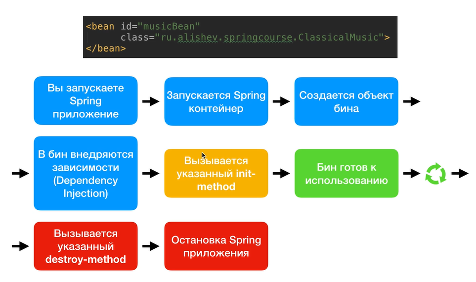

### init-method & destroy-method

### init-method
• Метод, который запускается в ходе инициализации бина. <br/>
• Инициализация ресурсов, обращение к внешним файлам, запуск БД.

### destroy-method
• Метод, который запускается в ходе уничтожения бина (при 
завершении работы приложения). <br/>
• Очищение ресурсов, закрытие потоков ввода-вывода,
закрытие доступа к БД.

### В коде:

```xml
<bean id="musicBean"
      class="us.ossowitz.springcourse.ClassicalMusic"
      init-method="doMyInit"
      destroy-method="doMyDestroy">
</bean>
```

Методы doMyInit() и doMyDestroy() создаются в классе бина (ClassicalMusic).

```java
public void doMyInit() {
        System.out.println("Do my initialization");
}

public void doMyDestroy() {
        System.out.println("Do my destruction");
}
```

### Тонкости работы с init и destroy методов:

• **Модификатор доступа** <br/>
У этих методов может быть любой модификатор доступа (public, protected, private). <br/>

• **Тип возвращаемого значения** <br/>
Может быть любой, но чаще всего используется void (так как нет возможности
получить возвращаемое значение). <br/>

• **Название метода** <br/>
Название может быть любым.<br/>

• **Аргументы метода** <br/>
Эти методы не должны принимать на вход какие-либо аргументы.

### Ещё одна тонкость
Для бинов со scope «prototype» Spring **не вызывает метод destroy-метод**. <br/>
Spring не берёт на себя полный жизненный цикл бинов со scope "prototype".
Spring отдаёт prototype бины клиенту и больше о них не заботится (в отличие
от singleton бинов).

### factory-method
[**Фабричный метод - это паттерн программирования**](https://github.com/Ossowitz/Patterns/tree/master/src/FactoryMethod)

**Вкратце:** паттерн "фабричный метод" предлагает создавать объекты не напрямую, используя оператор new, а через
вызов особого **фабричного метода**. Объекты всё равно будут создаваться при помощи **new**, но делать это будет
фабричный метод.

Если объекты класса создаются фабричным методом, то можно определить factory-method.

## Создание Spring Bean с помощью фабричных методов

### Пример создания без аргументов:

Мы можем создать класс Foo, который предоставляет создаваемый bean-компонент:
```java
public class Foo{}
```
Затем мы создаём класс InstanceFactoryMethod, который включает фабричный метод *createInstance*, который создаёт наш bean-компонент Foo:
```java
public class InstanceFooFactory {

   public Foo createInstance() {
      return new Foo();
   }
}
```
После этого настраиваем Spring: <br/>
1. Создайте bean-компонент для нашего фабричного класса (InstanceFooFactory). <br/>
2. Используйте атрибут factory-bean для ссылки на наш factory-bean. <br/>
3. Используйте атрибут factory-method для ссылки на наш заводской метод (createInstance).

Применив это к конфигурации Spring XML, мы получим:
```xml
<beans ...>

    <bean id="instanceFooFactory"
      class="com.baeldung.factorymethod.InstanceFooFactory" />

    <bean id="foo"
      factory-bean="instanceFooFactory"
      factory-method="createInstance" />

</beans>
```

## Аннотации

**Java Аннотации - это специальный тип **комментариев** в вашем коде с помощью которых можно:**

• Передавать какие-либо инструкции для Java компилятора (пример: аннотация @Override). <br/>
• Передавать какие-либо инструкции для анализаторов исходного кода. <br/>
• **Передавать метаданные, которые могут быть использованы либо вашим Java-приложением (с помощью рефлексии), 
либо другими приложениями или фреймворками (пример: Spring Framework).**

### Зачем использовать аннотации?

• Короче, чем XML-конфигурация. <br/>
• Удобнее, чем XML-конфигурация.<br/>
• Код становится более читабельным.

### Как работает конфигурация с помощью аннотаций?
• Spring **сканирует** все ваши классы. <br/>
• Находит классы со специальными аннотациями и **автоматически создаёт бины** из этих классов.

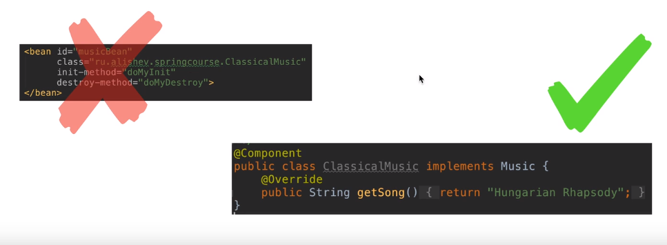

## Аннотация @Component

```java
@Component
public class ClassicalMusic implements Music {
    @Override
   public String getSong() {
        return "Hungarian Rhapsody";
   }
}
```

• Помечаем ей класс, если хотим, чтобы Spring Framework **создал бин** этого класса. <br/>
• Именно **эту** аннотацию Spring Framework ищет, когда сканирует наши классы. <br/>
• Можно указать **id** для создаваемого бина, можно не указывать (тогда название
будет *название_класса_с_маленькой буквы*).

## Аннотация @Autowired

**Мы больше не внедряем зависимость вручную, Spring сам ищет подходящий бин и автоматически внедряет его.**
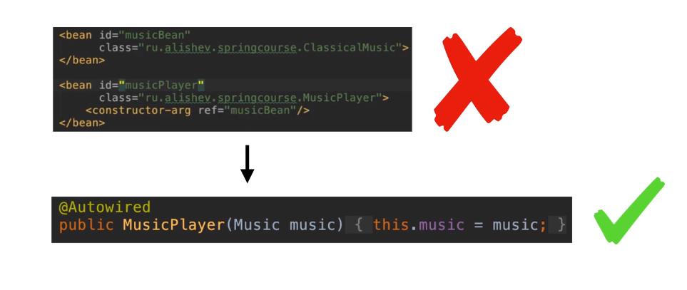

#### Как работает аннотация @Autowired?
*В данном примере в бин musicPlayer необходимо внедрить бин, который реализует интерфейс Music:

```java
@Autowired
public MusicPLayer(Music music) {
    this.music = music;    
}
```

В XML-файл:
```xml
<context:component-scan base-package="us.ossowitz.springcourse"/>
```

• **Spring сканирует все классы с аннотацией @Component и создаёт бины для этих классов. <br/>**
• **Spring сканирует все созданные бины и проверяет, подходит ли хотя бы один бин
в качестве зависимости там, где мы указывали аннотацию @Autowired.** <br/>
• Если находится один подходящий бин, он внедряется в качестве зависимости. <br/>
• Если не находится ни одного бина - **ошибка**. <br/>
• Если несколько бинов подходят - **неоднозначность**.

## Аннотация @Value
Для внедрения строк и других значений можно использовать аннотацию
@Value. В этом случае в сеттерах нет необходимости, как это было при
конфигурации с помощью XML-файла.

```java
@Value("${person.name}")
private String personName;

@Value("${person.age}")
private int age;
```

## Аннотация @Qualifier

Если при использовании @Autowired подходящих по типу бинов больше одного, то выбрасывается 
исключение. Предотвратить выброс данного исключения можно конкретно указав, какой
бин должен быть внедрён. Для этого используют аннотацию @Qualifier.

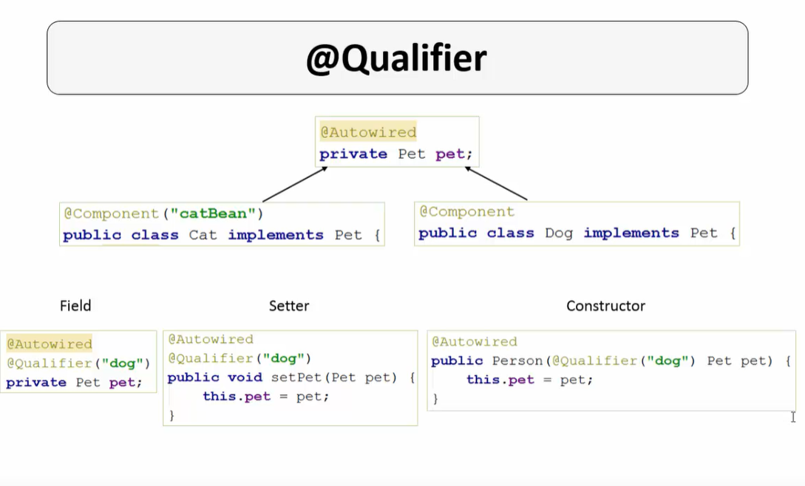

## Аннотация @Scope

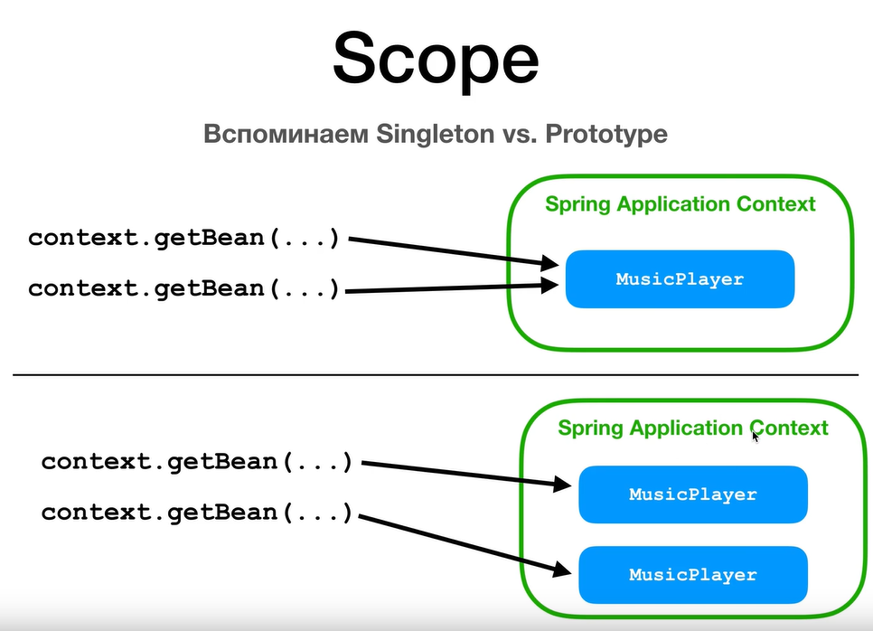

**Как это будет выглядеть с помощью аннотации:**


## Аннотация @PostConstruct и @PreDestroy

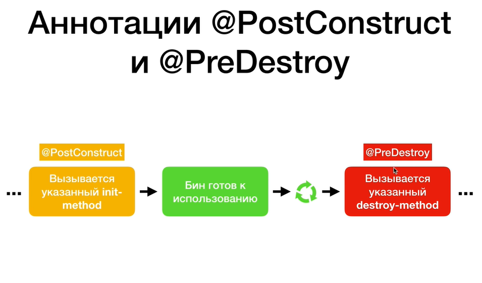

**Пример из кода:**

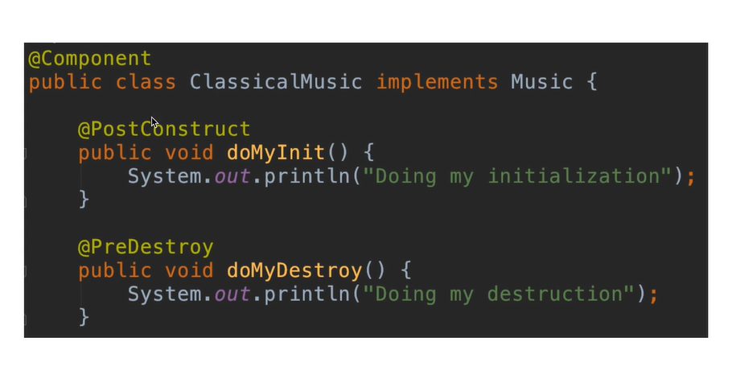

*Эти аннотации являются частью Java EE. И поскольку Java EE устарела в 
Java 9 и удалена в Java 11, необходимо добавить дополнительную зависимость
для использования этих аннотаций:*

```xml
<dependency>
    <groupId>javax.annotation</groupId>
    <artifactId>javax.annotation-api</artifactId>
    <version>1.3.2</version>
</dependency>
```

## Конфигурация с помощью Java-кода.

## Аннотация @Configuration
Помечает Java класс, который мы хотим использовать для конфигурации Spring-приложения.

```java
@Configuration
public class SpringConfig{
}
```

Пустой конфигурационный Java-класс равен по функционалу пустому конфигурационному XML файлу:

```xml
<?xml version="1.0" encoding="UTF-8"?>
<beans xmlns="http://www.springframework.org/schema/beans"
       xmlns:xsi="http://www.w3.org/2001/XMLSchema-instance"
       xmlns:context="http://www.springframework.org/schema/context"
       xsi:schemaLocation="http://www.springframework.org/schema/beans
        http://www.springframework.org/schema/beans/spring-beans.xsd
        http://www.springframework.org/schema/context
        http://www.springframework.org/schema/context/spring-context.xsd">
</beans>
```

## Для каждого XML-тега есть соответствующая аннотация:
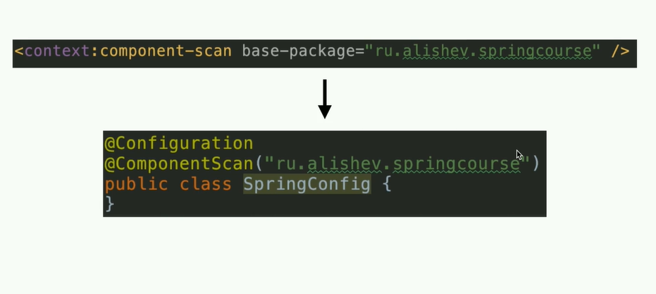

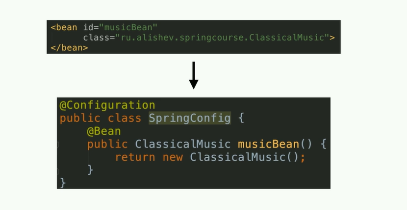

## Использование конфигурационного файла:

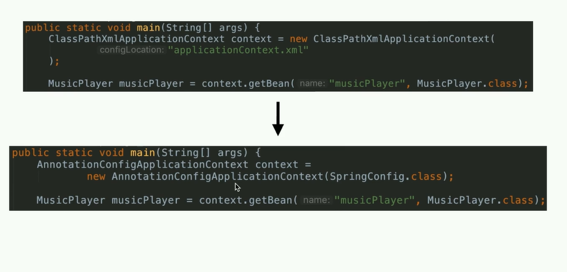

Ручное внедрение зависимостей (без @Autowired) с помощью Java-конфигурации:

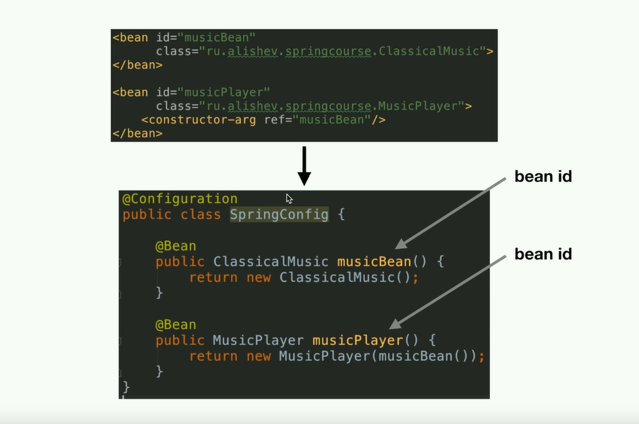

## Аннотация @Bean

```java
@Configuration
public class SpringConfig {
    
   @Bean
   public ClassicalMusic musicBean() {
        return new ClassicalMusic();
   }
   
   @Bean
   public MusicPlayer musicPlayer() {
       return new MusicPlayer(musicBean());
   }
}
```

• Как и в случае с XML-конфигурацией, по умолчанию у бинов scope=singleton <br/>
• Это значит, что тело @Bean методов по-умолчанию вызывается только один раз, 
а все последующие вызовы Spring прерывает и возвращает уже имеющийся бин из 
контекста.

## Внедрение значений из внешнего файла:
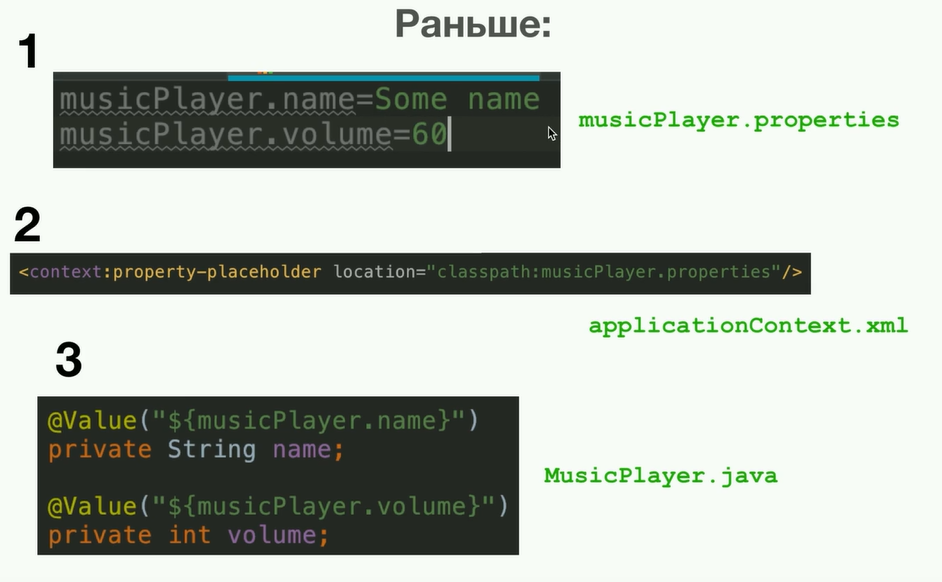

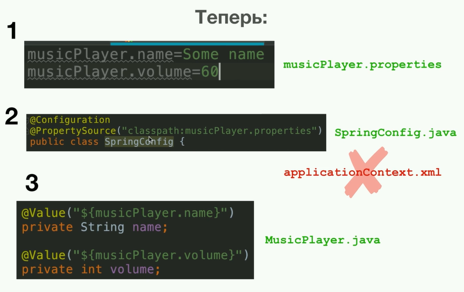

## Spring MVC

### Что такой Spring MVC?

* Один из компонентов Spring Framework, который позволяет разрабатывать web-приложения на Java
* Spring MVC предполагает разработку web-приложений с использованием архитектуры Model - View - Controller
* Разрабатывая web-приложения с помощью Spring MVC, мы можем использовать всё, что даёт нам Spring Core - бины, DI и так далее.

## MVC (Model - View - Controller)


*MVC - паттерн проектирования приложений*

* Model - логика работы с данными 
* View - логика представления, интерфейс
* Controller - логика навигации, обработка запросов

## Из чего состоит Spring MVC приложение?

• Из обычных Java-классов (контроллеры, модели и прочее). Очень активно используются
аннотации, которые применяются к классам и дают им дополнительные возможности (например,
аннотация @Controller). <br/>
• Набор HTML-страниц (представления). К ним часто добавляется JavaScript код, который
«оживляет» HTML представления и CSS, которые стилизует HTML. <br/>
• Spring конфигурация (XML, аннотации или Java).

## DispatcherServlet

*DispatcherServlet является центральной частью фреймворка Spring MVC, которая обрабатывает все запросы HTTP, поступающие к приложению. Она получает запросы и на основе конфигурации, определяет какой контроллер должен обработать запрос, получает данные от контроллера и передает их представлению, чтобы сформировать ответ клиенту.*

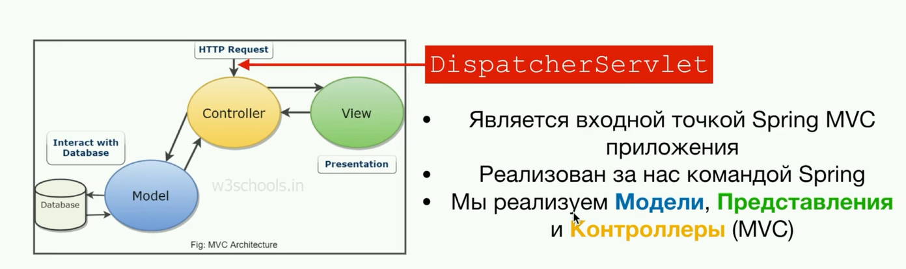

* Является входной точкой Spring MVC приложения.
* Реализован за нас командой Spring.
* Мы реализуем Модели, Представления и Контроллеры (MVC)

*HTTP-запрос от пользователя:*
1) Приходит на сервер. Сервер обрабатывает запрос и передаёт его на Spring MVC приложение.
2) Запрос попадает в DispatcherServlet.
3) DispatcherServlet отправляет запрос на правильный контроллер.

## Контроллер (Controller)
*Контроллер реализуется нами*

**Пример контроллера:**

```java
// TODO: 23.04.2023  
```

• Обрабатывает запросы от пользователя. <br/>
• Обменивается данными с моделью. <br/>
• Показывает пользователю правильное представление. <br/>
• Переадресовывает пользователя на другие страницы.

## Модель (Model)
*Модель реализуется нами*
```java
// TODO: 23.04.2023  
```

• Хранит в себе данные. <br/>
• Взаимодействует с БД для получения данных. <br/>
• Отдаёт данные контроллеру.

## Представление (View)
*Представление реализуется нами*

• Получает данные от контроллера и отображает их в браузере <br/>
• Для динамического отображения данных используются шаблонизаторы (Thymeleaf, Freemarker, Velocity)

## Тривиальное Spring-приложение, сконфигурированное с помощью XML-кода

**web.xml** <br/>
*Считывается сервером Apache Tomcat, конфигурирует DispatcherServlet.*

```xml
<?xml version="1.0" encoding="UTF-8"?>
<web-app xmlns:xsi="http://www.w3.org/2001/XMLSchema-instance"
         xmlns="http://xmlns.jcp.org/xml/ns/javaee"
         xsi:schemaLocation="http://xmlns.jcp.org/xml/ns/javaee http://xmlns.jcp.org/xml/ns/javaee/web-app_3_1.xsd"
         id="WebApp_ID" version="3.1">

    <display-name>spring-mvc-app1</display-name>

    <absolute-ordering/>

    <servlet>
        <servlet-name>dispatcher</servlet-name>
        <servlet-class>org.springframework.web.servlet.DispatcherServlet</servlet-class>
        <init-param>
            <param-name>contextConfigLocation</param-name>
            <param-value>/WEB-INF/applicationContextMVC.xml</param-value>
        </init-param>
        <load-on-startup>1</load-on-startup>
    </servlet>

    <servlet-mapping>
        <servlet-name>dispatcher</servlet-name>
        <url-pattern>/</url-pattern>
    </servlet-mapping>

</web-app>
```

**applicationContextMVC.xml** <br/>
*Конфигурация Spring-приложения (бины, component scan, настройка Thymeleaf).*

```xml
<?xml version="1.0" encoding="UTF-8"?>
<beans xmlns="http://www.springframework.org/schema/beans"
       xmlns:xsi="http://www.w3.org/2001/XMLSchema-instance"
       xmlns:context="http://www.springframework.org/schema/context"
       xmlns:mvc="http://www.springframework.org/schema/mvc"
       xsi:schemaLocation="
		http://www.springframework.org/schema/beans
    	http://www.springframework.org/schema/beans/spring-beans.xsd
    	http://www.springframework.org/schema/context
    	http://www.springframework.org/schema/context/spring-context.xsd
    	http://www.springframework.org/schema/mvc
        http://www.springframework.org/schema/mvc/spring-mvc.xsd">

    <context:component-scan base-package="us.ossowitz.springcourse"/>

    <mvc:annotation-driven/>

    <bean id="templateResolver" class="org.thymeleaf.spring5.templateresolver.SpringResourceTemplateResolver">
        <property name="prefix" value="/WEB-INF/views/"/>
        <property name="suffix" value=".html"/>
    </bean>

    <bean id="templateEngine" class="org.thymeleaf.spring5.SpringTemplateEngine">
        <property name="templateResolver" ref="templateResolver"/>
        <property name="enableSpringELCompiler" value="true"/>
    </bean>

    <bean class="org.thymeleaf.spring5.view.ThymeleafViewResolver">
        <property name="templateEngine" ref="templateEngine"/>
        <property name="order" value="1"/>
        <property name="viewNames" value="*"/>
    </bean>
</beans>
```

## Чем заменить web.xml?

*Начиная с 3 версии Spring Framework можно использовать Java-код вместо web.xml*

**Для этого необходимо в проекте создать Java-класс, который реализует интерфейс org.springframework.web.WebApplicationInitializer.**

```java
public class MyWebAppInitializer implements WebApplicationInitializer {
    
    @Override
    public void onStartup(ServletContext container) {
        // код, который до этого помещался в web.xml
    }
}
```

**Но также существует абстрактный класс AbstractAnnotationConfigDispatcherServletInitializer**

*Этот класс был представлен в Spring 3.2 и он реализует интерфейс WebApplicationInitializer за нас. Нам остаётся лишь подставить оставшиеся мелочи.*

