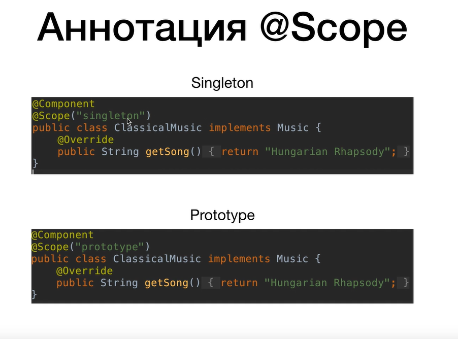
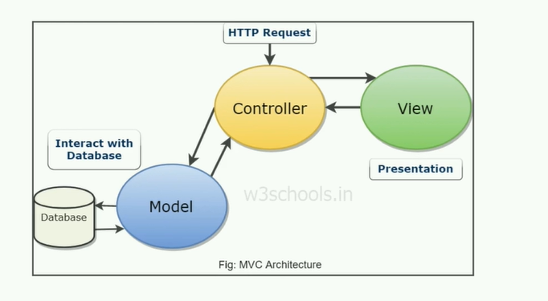
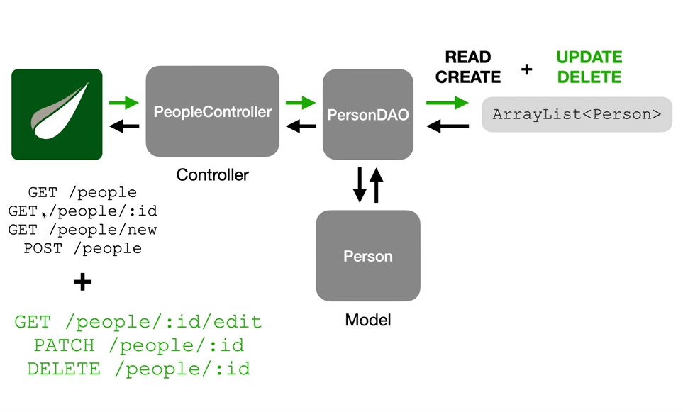

# SPRING FRAMEWORK

```java
/**
 * @// TODO: 14.04.2023
 * Подтяни все картинки в папку /photo
 */
```

# Spring Core

*Spring Core - IoC, DI, Beans, Configuration (XML, Annotation and Java), Autowiring*

## Inversion of Control (IoC)

## Проблема #1:

### Сильная зависимость:

MusicPlayer сильно зависит от ClassicalMusic. <br/>
Класс MusicPlayer "заточен" на работу только с ClassicalMusic.

```java
class ClassicalMusic {
    // Code to access classical music 
}

class MusicPlayer {
    private ClassicalMusic classicalMusic;

    public void playMusic() {
        // Code to play classical music 
    }
}
```

## Решение:

Использовать интерфейс (или абстрактный класс),
который бы обобщал различные музыкальные жанры.

```java
interface Music {
    // The code that is needed to access any genre of music
}

class ClassicalMusic implements Music {
    // Code to access classical music
}

class RockMusic implements Music {
    // code to access rock music
}

class MusicPlayer {
    private Music music;

    public void playMusic() {
        music = new ClassicalMusic();
        // or
        music = new RockMusic();

        // Code to play music
    }
}
```

## Проблема #2:

### Слабая зависимость:

Объекты создаются вручную. Мы хотим вынести эти детали в конфигурационный файл,
а не лезть каждый раз в код (и перекомпилировать его) для того, чтобы поменять объект.

```java
interface Music {
    // The code that is needed to access any genre of music
}

class ClassicalMusic implements Music {
    // Code to access classical music
}

class RockMusic implements Music {
    // code to access rock music
}

class MusicPlayer {
    private Music music;

    public void playMusic() {
        music = new ClassicalMusic();
        // or
        music = new RockMusic();

        // Code to play music
    }
}
```

## Решение:

Использовать Spring Framework, который сам создаст необходимые объекты (бины)
согласно конфигурационному файлу.

## Bean

• Это просто Java-объект, который создаётся и управляется Spring Container. <br/>
• Когда Java-объекты создаются с помощью Spring'а, они называются бинами (beans). <br/>
• Бины создаются из Java-классов (так же, как и обычные объекты).

```xml
<bean>id="testBean"
    class="us.ossowitz.springcourse.TestBean">
    <constructor-arg value="Ilya"/>
</bean>
```

• id - идентификатор бина <br/>
• class - полное имя класса

## Проблема #3:

MusicPlayer сам создаёт свои зависимости. Это архитектурно неправильно - противоречит принципу IoC.

```java
interface Music {
    // The code that is needed to access any genre of music
}

class ClassicalMusic implements Music {
    // Code to access classical music
}

class RockMusic implements Music {
    // code to access rock music
}

class MusicPlayer {
    private Music music;

    public void playMusic() {
        music = new ClassicalMusic();
        // or
        music = new RockMusic();

        // Code to play music
    }
}
```

## Решение:

Использовать принцип IoC.

# Inversion of Control (IoC)

```java
interface Music {
    // The code that is needed to access any genre of music
}

class ClassicalMusic implements Music {
    // Code to access classical music
}

class RockMusic implements Music {
    // code to access rock music
}

class MusicPlayer {
    private Music music;

    public void playMusic() {
        music = new ClassicalMusic();
        // or
        music = new RockMusic();

        // Code to play music
    }
}
```

• MusicPlayer зависит от классов, реализующих интерфейс Music. <br/>
• MusicPlayer сам создаёт объект ClassicalMusic. <br/>
• Вместо этого мы хотим передавать объект ClassicalMusic внутрь
MusicPlayer - это и называется инверсией управления (IoC).

### Инверсия управления - это такой архитектурный подход, когда сущность не сама создаёт свои зависимости, а когда этой сущности зависимости поставляются извне.

## Последняя проблема

```java
class MusicPlayer {
    private Music music;

    // Зависимость внедряется извне (IoC)
    public MusicPlayer(Music music) {
        this.music = music;
    }

    public void playMusic() {
        // Больше не создаём объекты!

        // ... Код для воспроизведения музыки
    }
}
```

Объект, который мы хотим внедрить в MusicPlayer необходимо где-то создать.

```java
class UseMusicPlayer {
    public static void main(String[] args) {
        MusicPlayer musicPlayer = new MusicPlayer(new ClassicalMusic());
    }
}
```

**Эту проблему можно решить с помощью внедрения зависимостей (Dependency Injection).** <br/>
Этой задачей тоже занимается Spring Framework.

## Spring можно конфигурировать с помощью:

• XML-файла конфигураций (старый способ, но многие существующие приложения
до сих пор его используют). <br/>
• Java-аннотаций и немного XML (современный способ). <br/>
• Вся конфигурация на Java-коде (современный).

## Способы внедрения зависимостей

• Через конструктор. <br/>
• Через setter. <br/>
• Есть множество конфигураций того, как внедрять (scope, factory method и т.д.). <br/>
• Можно внедрять через XML, аннотации или Java-код. <br/>
• Процесс внедрения можно автоматизировать (Autowiring).

### Внедрение (Injection) с помощью конструктора

```xml
<bean id="musicBean"
      class="us.ossowitz.springcourse.ClassicalMusic">
</bean>

<bean id="musicPlayer"
      class="us.ossowitz.springcourse.MusicPlayer">
<constructor-arg ref="musicBean"/>
</bean>
```

### Использование

```java
MusicPlayer musicPlayer=context.getBean("musicPlayer",MusicPlayer.class);
musicPlayer.playMusic();
```

### Внедрение зависимостей через setter

```java
public void setMusic(Music music){
        this.music=music;
}
```

```xml
<bean id="musicPlayer"
      class="us.ossowitz.springcourse.MusicPlayer">
    <property name="music" ref="musicBean"/>
</bean>
```

### Внедрение простых значений

```java
private String name;
private int volume;

public void setName(String name){
        this.name=name;
}

public void setVolume(int volume){
        this.volume=volume;
}
```

```xml
<property name="name" value="Some name"/>
<property name="volume" value="50"/>
```

### Внедрение простых значений из внешнего файла

• Не хотим каждый раз лезть в applicationContext.xml <br/>
• Хотим все простые значения указать в одном файле.

1. Создаём файл, расширения .properties <br/>
   Содержимое: <br/>

```text
musicPlayer.name=Some name
musicPlayer.volume=70
```

2. В applicationContext.xml подтягиваем путь до файла musicPlayer.properties: <br/>

```xml
<context:property-placeholder location="classpath:musicPlayer.properties"/>
```

3. Внедряем зависимости: <br/>

```xml
<property name="name" value="${musicPlayer.name}"/>
<property name="volume" value="${musicPlayer.volume}"/>
```

## Scope

**Scope задаёт то, как Spring будет создавать ваши бины. <br/>
Определяет жизненный цикл бина и возможное количество создаваемых бинов.**

### Singleton

**Scope, который используется по умолчанию**

```xml
<bean id="musicBean"
      class="us.ossowitz.springcourse.MusicPlayer">
</bean>
```

• По умолчанию создаётся объект (он создаётся до вызова метода getBean()). <br/>
• При всех вызовах getBean() возвращается ссылка на один и тот же единственный объект. <br/>
• Подходит для stateless-объектов (объекты, состояние
которых нам менять не приходится. Потому что если мы будем изменять состояние
у Singleton бина, столкнёмся с проблемой).

### Prototype

**Scope, который каждый раз создаёт новый объект при вызове getBean()**

• Такой бин создаётся только после обращения к Spring Container-у 
с помощью метода getBean(). <br/>
• Для каждого такого обращения создаётся новый бин в Spring Container. <br/>
• Чаще всего используется тогда, когда у нашего бина есть изменяемые состояния (stateful). <br/>

## Жизненный цикл бина (Bean lifecycle)


### init-method & destroy-method

### init-method
• Метод, который запускается в ходе инициализации бина. <br/>
• Инициализация ресурсов, обращение к внешним файлам, запуск БД.

### destroy-method
• Метод, который запускается в ходе уничтожения бина (при 
завершении работы приложения). <br/>
• Очищение ресурсов, закрытие потоков ввода-вывода,
закрытие доступа к БД.

### В коде:

```xml
<bean id="musicBean"
      class="us.ossowitz.springcourse.ClassicalMusic"
      init-method="doMyInit"
      destroy-method="doMyDestroy">
</bean>
```

Методы doMyInit() и doMyDestroy() создаются в классе бина (ClassicalMusic).

```java
public void doMyInit() {
        System.out.println("Do my initialization");
}

public void doMyDestroy() {
        System.out.println("Do my destruction");
}
```

### Тонкости работы с init и destroy методов:

• **Модификатор доступа** <br/>
У этих методов может быть любой модификатор доступа (public, protected, private). <br/>

• **Тип возвращаемого значения** <br/>
Может быть любой, но чаще всего используется void (так как нет возможности
получить возвращаемое значение). <br/>

• **Название метода** <br/>
Название может быть любым.<br/>

• **Аргументы метода** <br/>
Эти методы не должны принимать на вход какие-либо аргументы.

### Ещё одна тонкость
Для бинов со scope «prototype» Spring **не вызывает метод destroy-метод**. <br/>
Spring не берёт на себя полный жизненный цикл бинов со scope "prototype".
Spring отдаёт prototype бины клиенту и больше о них не заботится (в отличие
от singleton бинов).

### factory-method
[**Фабричный метод - это паттерн программирования**](https://github.com/Ossowitz/Patterns/blob/master/src/FactoryMethod.md)

**Вкратце:** паттерн "фабричный метод" предлагает создавать объекты не напрямую, используя оператор new, а через
вызов особого **фабричного метода**. Объекты всё равно будут создаваться при помощи **new**, но делать это будет
фабричный метод.

Если объекты класса создаются фабричным методом, то можно определить factory-method.

## Создание Spring Bean с помощью фабричных методов

### Пример создания без аргументов:

Мы можем создать класс Foo, который предоставляет создаваемый bean-компонент:
```java
public class Foo{}
```
Затем мы создаём класс InstanceFactoryMethod, который включает фабричный метод *createInstance*, который создаёт наш bean-компонент Foo:
```java
public class InstanceFooFactory {

   public Foo createInstance() {
      return new Foo();
   }
}
```
После этого настраиваем Spring: <br/>
1. Создайте bean-компонент для нашего фабричного класса (InstanceFooFactory). <br/>
2. Используйте атрибут factory-bean для ссылки на наш factory-bean. <br/>
3. Используйте атрибут factory-method для ссылки на наш заводской метод (createInstance).

Применив это к конфигурации Spring XML, мы получим:
```xml
<beans ...>

    <bean id="instanceFooFactory"
      class="com.baeldung.factorymethod.InstanceFooFactory" />

    <bean id="foo"
      factory-bean="instanceFooFactory"
      factory-method="createInstance" />

</beans>
```

## Аннотации

**Java Аннотации - это специальный тип **комментариев** в вашем коде с помощью которых можно:**

• Передавать какие-либо инструкции для Java компилятора (пример: аннотация @Override). <br/>
• Передавать какие-либо инструкции для анализаторов исходного кода. <br/>
• **Передавать метаданные, которые могут быть использованы либо вашим Java-приложением (с помощью рефлексии), 
либо другими приложениями или фреймворками (пример: Spring Framework).**

### Зачем использовать аннотации?

• Короче, чем XML-конфигурация. <br/>
• Удобнее, чем XML-конфигурация.<br/>
• Код становится более читабельным.

### Как работает конфигурация с помощью аннотаций?
• Spring **сканирует** все ваши классы. <br/>
• Находит классы со специальными аннотациями и **автоматически создаёт бины** из этих классов.


## Аннотация @Component

```java
@Component
public class ClassicalMusic implements Music {
    @Override
   public String getSong() {
        return "Hungarian Rhapsody";
   }
}
```

• Помечаем ей класс, если хотим, чтобы Spring Framework **создал бин** этого класса. <br/>
• Именно **эту** аннотацию Spring Framework ищет, когда сканирует наши классы. <br/>
• Можно указать **id** для создаваемого бина, можно не указывать (тогда название
будет *название_класса_с_маленькой буквы*).

## Аннотация @Autowired

**Мы больше не внедряем зависимость вручную, Spring сам ищет подходящий бин и автоматически внедряет его.**


#### Как работает аннотация @Autowired?
*В данном примере в бин musicPlayer необходимо внедрить бин, который реализует интерфейс Music:

```java
@Autowired
public MusicPLayer(Music music) {
    this.music = music;    
}
```

В XML-файл:
```xml
<context:component-scan base-package="us.ossowitz.springcourse"/>
```

• **Spring сканирует все классы с аннотацией @Component и создаёт бины для этих классов. <br/>**
• **Spring сканирует все созданные бины и проверяет, подходит ли хотя бы один бин
в качестве зависимости там, где мы указывали аннотацию @Autowired.** <br/>
• Если находится один подходящий бин, он внедряется в качестве зависимости. <br/>
• Если не находится ни одного бина - **ошибка**. <br/>
• Если несколько бинов подходят - **неоднозначность**.

## Аннотация @Value
Для внедрения строк и других значений можно использовать аннотацию
@Value. В этом случае в сеттерах нет необходимости, как это было при
конфигурации с помощью XML-файла.

```java
@Value("${person.name}")
private String personName;

@Value("${person.age}")
private int age;
```

## Аннотация @Qualifier

Если при использовании @Autowired подходящих по типу бинов больше одного, то выбрасывается 
исключение. Предотвратить выброс данного исключения можно конкретно указав, какой
бин должен быть внедрён. Для этого используют аннотацию @Qualifier.


## Аннотация @Scope


**Как это будет выглядеть с помощью аннотации:**



## Аннотация @PostConstruct и @PreDestroy


**Пример из кода:**


*Эти аннотации являются частью Java EE. И поскольку Java EE устарела в 
Java 9 и удалена в Java 11, необходимо добавить дополнительную зависимость
для использования этих аннотаций:*

```xml
<dependency>
    <groupId>javax.annotation</groupId>
    <artifactId>javax.annotation-api</artifactId>
    <version>1.3.2</version>
</dependency>
```

## Конфигурация с помощью Java-кода.

## Аннотация @Configuration
Помечает Java класс, который мы хотим использовать для конфигурации Spring-приложения.

```java
@Configuration
public class SpringConfig{
}
```

Пустой конфигурационный Java-класс равен по функционалу пустому конфигурационному XML файлу:

```xml
<?xml version="1.0" encoding="UTF-8"?>
<beans xmlns="http://www.springframework.org/schema/beans"
       xmlns:xsi="http://www.w3.org/2001/XMLSchema-instance"
       xmlns:context="http://www.springframework.org/schema/context"
       xsi:schemaLocation="http://www.springframework.org/schema/beans
        http://www.springframework.org/schema/beans/spring-beans.xsd
        http://www.springframework.org/schema/context
        http://www.springframework.org/schema/context/spring-context.xsd">
</beans>
```

## Для каждого XML-тега есть соответствующая аннотация:


## Использование конфигурационного файла:


Ручное внедрение зависимостей (без @Autowired) с помощью Java-конфигурации:


## Аннотация @Bean

```java
@Configuration
public class SpringConfig {
    
   @Bean
   public ClassicalMusic musicBean() {
        return new ClassicalMusic();
   }
   
   @Bean
   public MusicPlayer musicPlayer() {
       return new MusicPlayer(musicBean());
   }
}
```

• Как и в случае с XML-конфигурацией, по умолчанию у бинов scope=singleton <br/>
• Это значит, что тело @Bean методов по-умолчанию вызывается только один раз, 
а все последующие вызовы Spring прерывает и возвращает уже имеющийся бин из 
контекста.

## Внедрение значений из внешнего файла:


## Spring MVC

### Что такой Spring MVC?

* Один из компонентов Spring Framework, который позволяет разрабатывать web-приложения на Java
* Spring MVC предполагает разработку web-приложений с использованием архитектуры Model - View - Controller
* Разрабатывая web-приложения с помощью Spring MVC, мы можем использовать всё, что даёт нам Spring Core - бины, DI и так далее.

## MVC (Model - View - Controller)



*MVC - паттерн проектирования приложений*

* Model - логика работы с данными 
* View - логика представления, интерфейс
* Controller - логика навигации, обработка запросов


## Из чего состоит Spring MVC приложение?

• Из обычных Java-классов (контроллеры, модели и прочее). Очень активно используются
аннотации, которые применяются к классам и дают им дополнительные возможности (например,
аннотация @Controller). <br/>
• Набор HTML-страниц (представления). К ним часто добавляется JavaScript код, который
«оживляет» HTML представления и CSS, которые стилизует HTML. <br/>
• Spring конфигурация (XML, аннотации или Java).

## DispatcherServlet

*DispatcherServlet является центральной частью фреймворка Spring MVC, которая обрабатывает все запросы HTTP, поступающие к приложению. Она получает запросы и на основе конфигурации, определяет какой контроллер должен обработать запрос, получает данные от контроллера и передает их представлению, чтобы сформировать ответ клиенту.*


* Является входной точкой Spring MVC приложения.
* Реализован за нас командой Spring.
* Мы реализуем Модели, Представления и Контроллеры (MVC)

*HTTP-запрос от пользователя:*
1) Приходит на сервер. Сервер обрабатывает запрос и передаёт его на Spring MVC приложение.
2) Запрос попадает в DispatcherServlet.
3) DispatcherServlet отправляет запрос на правильный контроллер.

## Контроллер (Controller)
*Контроллер реализуется нами*

**Пример контроллера:**

```java
// TODO: 23.04.2023  
```

• Обрабатывает запросы от пользователя. <br/>
• Обменивается данными с моделью. <br/>
• Показывает пользователю правильное представление. <br/>
• Переадресовывает пользователя на другие страницы.

## Модель (Model)
*Модель реализуется нами*
```java
// TODO: 23.04.2023  
```

• Хранит в себе данные. <br/>
• Взаимодействует с БД для получения данных. <br/>
• Отдаёт данные контроллеру.

## Представление (View)
*Представление реализуется нами*

• Получает данные от контроллера и отображает их в браузере <br/>
• Для динамического отображения данных используются шаблонизаторы (Thymeleaf, Freemarker, Velocity)

## Тривиальное Spring-приложение, сконфигурированное с помощью XML-кода

**web.xml** <br/>
*Считывается сервером Apache Tomcat, конфигурирует DispatcherServlet. <br/>*
*web.xml - deployment descriptor (дескриптор развёртывания).*

## Зачем нужен файл web.xml?

Сервер (в нашем случае Apache Tomcat) считывает содержимое файла web.xml. В этом файле мы можем описать, что мы бы хотели, что бы сервер делал. В нашем случае, мы хотим, что бы сервер все HTTP-запросы от пользователей перенаправлял на DispatcherServlet. И когда запрос будет попадать сначала в сервер, потом в DispatcherServlet - этот запрос будет попадать в наше Spring MVC приложение.

```xml
<servlet>
        <servlet-name>dispatcher</servlet-name>
        <servlet-class>org.springframework.web.servlet.DispatcherServlet</servlet-class>
        <init-param>
            <param-name>contextConfigLocation</param-name>
            <param-value>/WEB-INF/applicationContextMVC.xml</param-value>
        </init-param>
        <load-on-startup>1</load-on-startup>
    </servlet>

    <servlet-mapping>
        <servlet-name>dispatcher</servlet-name>
        <url-pattern>/</url-pattern>
    </servlet-mapping>
``` 
Здесь, с помощью тега servlet мы создаём наш DispatcherServlet. 
При его создании мы должны ему указать в качестве параметра путь до того файла, где находится Spring-конфигурация. 
Параметр load-on-startup указывает на то, что DispatcherServlet нужно в первую очередь загружать в наш сервер.
Далее, с помощью тега servlet-mapping мы обращаемся к нашему dispatcher и указываем, что любой url ("/" означает, что любой url), который пользователь введёт в браузере, 
должен перенаправляться на наш DispatcherServlet. <br/>
**DispatcherServlet перенаправит запрос от пользователя на правильный контроллер, который мы будем реализовывать.**

### Итоговое представление web.xml:

```xml
<?xml version="1.0" encoding="UTF-8"?>
<web-app xmlns:xsi="http://www.w3.org/2001/XMLSchema-instance"
         xmlns="http://xmlns.jcp.org/xml/ns/javaee"
         xsi:schemaLocation="http://xmlns.jcp.org/xml/ns/javaee http://xmlns.jcp.org/xml/ns/javaee/web-app_3_1.xsd"
         id="WebApp_ID" version="3.1">

    <display-name>spring-mvc-app1</display-name>

    <absolute-ordering/>

    <servlet>
        <servlet-name>dispatcher</servlet-name>
        <servlet-class>org.springframework.web.servlet.DispatcherServlet</servlet-class>
        <init-param>
            <param-name>contextConfigLocation</param-name>
            <param-value>/WEB-INF/applicationContextMVC.xml</param-value>
        </init-param>
        <load-on-startup>1</load-on-startup>
    </servlet>

    <servlet-mapping>
        <servlet-name>dispatcher</servlet-name>
        <url-pattern>/</url-pattern>
    </servlet-mapping>

</web-app>
```

**applicationContextMVC.xml** <br/>
*Конфигурация Spring-приложения (бины, component scan, настройка Thymeleaf).*

```xml
<?xml version="1.0" encoding="UTF-8"?>
<beans xmlns="http://www.springframework.org/schema/beans"
       xmlns:xsi="http://www.w3.org/2001/XMLSchema-instance"
       xmlns:context="http://www.springframework.org/schema/context"
       xmlns:mvc="http://www.springframework.org/schema/mvc"
       xsi:schemaLocation="
		http://www.springframework.org/schema/beans
    	http://www.springframework.org/schema/beans/spring-beans.xsd
    	http://www.springframework.org/schema/context
    	http://www.springframework.org/schema/context/spring-context.xsd
    	http://www.springframework.org/schema/mvc
        http://www.springframework.org/schema/mvc/spring-mvc.xsd">

    <context:component-scan base-package="us.ossowitz.springcourse"/>

    <mvc:annotation-driven/>

    <bean id="templateResolver" class="org.thymeleaf.spring5.templateresolver.SpringResourceTemplateResolver">
        <property name="prefix" value="/WEB-INF/views/"/>
        <property name="suffix" value=".html"/>
    </bean>

    <bean id="templateEngine" class="org.thymeleaf.spring6.SpringTemplateEngine">
        <property name="templateResolver" ref="templateResolver"/>
        <property name="enableSpringELCompiler" value="true"/>
    </bean>

    <bean class="org.thymeleaf.spring5.view.ThymeleafViewResolver">
        <property name="templateEngine" ref="templateEngine"/>
        <property name="order" value="1"/>
        <property name="viewNames" value="*"/>
    </bean>
</beans>
```

## Чем заменить web.xml?

*Начиная с 3 версии в Spring Framework можно использовать Java-код вместо web.xml.*

**Для этого необходимо в проекте создать Java-класс, который реализует интерфейс org.springframework.web.WebApplicationInitializer.**

```java
public class MyWebAppInitializer implements WebApplicationInitializer {
    
    @Override
    public void onStartup(ServletContext container) {
        // код, который до этого помещался в web.xml
    }
}
```

**Но также существует абстрактный класс AbstractAnnotationConfigDispatcherServletInitializer.**

*Этот класс был представлен в Spring 3.2 и он реализует интерфейс WebApplicationInitializer за нас. Нам остаётся лишь подставить оставшиеся мелочи.*

## Аннотация @EnableWebMvc

@EnableWebMvc эквивалентен <mvc:annotation-driven/> в XML. Он включает поддержку @Controller-аннотированных классов, которые используются @RequestMapping для сопоставления входящих запросов с определенным методом.

## Конфигурация с помощью Java-кода:

*Вместо applicationContextMVC мы используем созданный класс SpringConfig:*

*Конфигурация с помощью XML-файла:*

```xml
<?xml version="1.0" encoding="UTF-8"?>
<beans xmlns="http://www.springframework.org/schema/beans"
       xmlns:xsi="http://www.w3.org/2001/XMLSchema-instance"
       xmlns:context="http://www.springframework.org/schema/context"
       xmlns:mvc="http://www.springframework.org/schema/mvc"
       xsi:schemaLocation="
		http://www.springframework.org/schema/beans
    	http://www.springframework.org/schema/beans/spring-beans.xsd
    	http://www.springframework.org/schema/context
    	http://www.springframework.org/schema/context/spring-context.xsd
    	http://www.springframework.org/schema/mvc
        http://www.springframework.org/schema/mvc/spring-mvc.xsd">

    <context:component-scan base-package="us.ossowitz.springcourse"/>

    <mvc:annotation-driven/>

    <bean id="templateResolver" class="org.thymeleaf.spring5.templateresolver.SpringResourceTemplateResolver">
        <property name="prefix" value="/WEB-INF/views/"/>
        <property name="suffix" value=".html"/>
    </bean>

    <bean id="templateEngine" class="org.thymeleaf.spring5.SpringTemplateEngine">
        <property name="templateResolver" ref="templateResolver"/>
        <property name="enableSpringELCompiler" value="true"/>
    </bean>

    <bean class="org.thymeleaf.spring5.view.ThymeleafViewResolver">
        <property name="templateEngine" ref="templateEngine"/>
        <property name="order" value="1"/>
        <property name="viewNames" value="*"/>
    </bean>
</beans>
```

*Конфигурация с помощью Java-кода:*
```java
package us.ossowitz.springcourse.config;

import org.springframework.beans.factory.annotation.Autowired;
import org.springframework.context.ApplicationContext;
import org.springframework.context.annotation.Bean;
import org.springframework.context.annotation.ComponentScan;
import org.springframework.context.annotation.Configuration;
import org.springframework.web.servlet.config.annotation.EnableWebMvc;
import org.springframework.web.servlet.config.annotation.ViewResolverRegistry;
import org.springframework.web.servlet.config.annotation.WebMvcConfigurer;
import org.thymeleaf.spring5.SpringTemplateEngine;
import org.thymeleaf.spring5.templateresolver.SpringResourceTemplateResolver;
import org.thymeleaf.spring5.view.ThymeleafViewResolver;

@Configuration
@ComponentScan("us.ossowitz.springcourse")
@EnableWebMvc
public class SpringConfig implements WebMvcConfigurer {
    private final ApplicationContext applicationContext;

    @Autowired
    public SpringConfig(ApplicationContext applicationContext) {
        this.applicationContext = applicationContext;
    }

    @Bean
    public SpringResourceTemplateResolver templateResolver() {
        SpringResourceTemplateResolver templateResolver = new SpringResourceTemplateResolver();
        templateResolver.setApplicationContext(applicationContext);
        templateResolver.setPrefix("/WEB-INF/views/");
        templateResolver.setSuffix(".html");
        return templateResolver;
    }

    @Bean
    public SpringTemplateEngine templateEngine() {
        SpringTemplateEngine templateEngine = new SpringTemplateEngine();
        templateEngine.setTemplateResolver(templateResolver());
        templateEngine.setEnableSpringELCompiler(true);
        return templateEngine;
    }

    @Override
    public void configureViewResolvers(ViewResolverRegistry registry) {
        ThymeleafViewResolver resolver = new ThymeleafViewResolver();
        resolver.setTemplateEngine(templateEngine());
        registry.viewResolver(resolver);
    }
}
```

*Также, как мы подставляли путь до applicationContextMVC.xml:*
```xml
<servlet>
        <servlet-name>dispatcher</servlet-name>
        <servlet-class>org.springframework.web.servlet.DispatcherServlet</servlet-class>
        <init-param>
            <param-name>contextConfigLocation</param-name>
            <param-value>/WEB-INF/applicationContextMVC.xml</param-value>
        </init-param>
        <load-on-startup>1</load-on-startup>
    </servlet>
```

*Мы должны подставить наш класс SpringConfig в метод класса MySpringMvcDispatcherServletInitializer:*
```java
package us.ossowitz.springcourse.config;

import org.springframework.web.servlet.support.AbstractAnnotationConfigDispatcherServletInitializer;

public class MySpringMvcDispatcherServletInitializer extends AbstractAnnotationConfigDispatcherServletInitializer {
    @Override
    protected Class<?>[] getRootConfigClasses() {
        return new Class[0];
    }

    @Override
    protected Class<?>[] getServletConfigClasses() {
        return new Class[]{SpringConfig.class};
    }

    @Override
    protected String[] getServletMappings() {
        return new String[]{"/"};
    }
}
```

*А в методе getServletMappings() мы должны вернуть "/", как это делали в web.xml: *
```xml
<servlet-mapping>
        <servlet-name>dispatcher</servlet-name>
        <url-pattern>/</url-pattern>
    </servlet-mapping>
```
*Все http-запросы пользователя посылаем на DispatcherServlet.*

## Контроллеры


### Аннотация @Controller

• Помечает класс-контроллер. <br/>
• Наследуется от аннотации @Component. <br/>
• Поэтому, @ComponentScan работает с @Controller так же, как и просто с @Component. <br/>
• @Controller - тот же @Component, но с дополнительными возможностями.

### Методы контроллеров

• Методов может быть несколько в контроллере. <br/>
• Обычно (но не всегда), каждый метод соответствует одному URL'у. <br/>
• Обычно (но не всегда), методы возвращают строку(String) - название представления, которое надо показать пользователю. <br/>
• У метода может быть любое название. <br/>

### Маппинги


**Виды маппинга:**

•@GetMapping <br/>
•@PostMapping <br/>
•@PutMapping <br/>
•@DeleteMapping <br/>
•@PatchMapping

**Иногда пишут(устаревший вариант):** <br/>
@RequestMapping(method=RequestMethod.GET)

• Связывают метод контроллера с адресом, по которому можно к этому методу обратиться (из браузера, например). <br/>
• Всего 5 разных видов маппинга - в зависимости от того, какой HTTP-запрос (с каким HTTP-методом) должен прийти в этот метод контроллера.

## Аннотация @RequestMapping на классе

Эта аннотация может использоваться на методе (устаревший способ - лучше использовать новые аннотации):
```java
@RequestMapping(value = "/new", method = RequestMethod.GET)
public String newPerson(Model model){
    // some code
} 
```


**В этом случае URL-адреса всех методов будут обязательно иметь в себе /people в начале**

## Параметры GET-запроса в Spring Framework

*Можно получить двумя способами:*

1. С помощью объекта HttpServletRequest:


2. С помощью Аннотации @RequestMapping


Такая конструкция позволяет выполнить запрос без параметров:


Также в **href**, который содержит URL, мы можем указать параметры:


## Модель


## Передача данных от контроллера к представлению


## Получение доступа к модели в контроллере


Использование Thymeleaf для обращения к модели и динамического генерирования текста


## CRUD

*Стандартная классификация функций по манипуляции данными*

Четыре базовые функции, используемые при работе с базами данных: <br/>
• CREATE <br/>
• READ <br/>
• UPDATE <br/>
• DELETE <br/>

**CRUD-приложение - это приложение, которое позволяет добавлять(CREATE), читать(READ), обновлять(UPDATE) и удалять(DELETE) данные.**


Чаще всего CRUD-приложения являются Web-приложениями. То есть, доступ к БД предоставляется через протокол HTTP.


*Большинство Web-приложений - CRUD-приложения.*

**Пример CRUD'а сущности POST:**


• REST - это паттерн проектирования web-приложений. <br/>
• REST описывает то, как посредством протокола HTTP клиент должен взаимодействовать с сервером. <br/>
• Всё взаимодействие с сервером сводится к 4 операциям - получение данных, добавление новых данных, изменение существующих данных, удаление данных. <br/>
• Для каждой из 4 операций используется свой HTTP-метод - GET, POST, PATCH, DELETE.

## CRUD vs REST

**CRUD** - четыре базовые функции, используемые при работе с базами данных. <br/>
**REST** - паттерн проектирования web-приложений. Описывает, как по протоколу HTTP взаимодействовать с сервером для чтения, добавления, изменения, удаления данных. Описывает, какие URL'ы, HTTP-методы использовать (но не только это).


## Пример реализации CRUD-приложения для сущности Person.


*Согласно конвенции об именовании контроллеров, название контроллера должно быть во множественном числе: Person -> PeopleController.*

## Связь с БД
*Паттерн DAO (Data Access Object)*


Мы хотим вынести логику взаимодействия с БД из самой модели в отдельный класс. Паттерн проектирования, когда отдельный класс занимается взаимодействием с БД для конкретной сущности, называется DAO.


• Вся логика работы с БД для модели Person инкапсулируется в класс PersonDAO <br/>
• В DAO классах обычно пишется SQL-код для работы с БД приложения (чтение, запись, обновление, удаление) <br/>
• Есть другой паттерн взаимодействия с БД - репозиторий (англ. repository). Этот паттерн предоставляет большую абстракцию над БД, чем DAO.

## Пример тривиального CRUD-приложения по отображению person: всего списка, а также по индексу.


**Структура проекта:**


**Тело класса Person:**

```java
public class Person {
    private int id;
    private String name;

    public Person(int id, String name) {
        this.id = id;
        this.name = name;
    }

    public int getId() {
        return id;
    }

    public void setId(int id) {
        this.id = id;
    }

    public String getName() {
        return name;
    }

    public void setName(String name) {
        this.name = name;
    }
}
```

**Класс PersonDAO:**

```java
@Component
public class PersonDAO {
    private List<Person> people;
    private static int PEOPLE_COUNT;

    {
        people = new ArrayList<>();

        people.add(new Person(++PEOPLE_COUNT, "Tom"));
        people.add(new Person(++PEOPLE_COUNT, "Bob"));
        people.add(new Person(++PEOPLE_COUNT, "Mike"));
        people.add(new Person(++PEOPLE_COUNT, "Katy"));
    }

    public List<Person> index() {
        return people;
    }

    public Person show(int id) {
        return people.stream().filter(person -> id == person.getId()).findAny().orElse(null);
    }
}
```

**Логика контроллера PersonDAO:**

```java
@Component
public class PersonDAO {
    private List<Person> people;
    private static int PEOPLE_COUNT;

    {
        people = new ArrayList<>();

        people.add(new Person(++PEOPLE_COUNT, "Tom"));
        people.add(new Person(++PEOPLE_COUNT, "Bob"));
        people.add(new Person(++PEOPLE_COUNT, "Mike"));
        people.add(new Person(++PEOPLE_COUNT, "Katy"));
    }

    public List<Person> index() {
        return people;
    }

    public Person show(int id) {
        return people.stream().filter(person -> id == person.getId()).findAny().orElse(null);
    }
}
```

**Отображение index:**

```html
<!DOCTYPE html>
<html lang="en">
<head>
    <meta charset="UTF-8">
    <title>Все люди</title>
</head>
<body>

<div th:each="person : ${people}">
    <a th:href="@{/people/{id}(id=${person.getId()})}" th:text="${person.getName()}">user</a>
</div>

</body>
</html>
```

**Отображение show:**

```html
<!DOCTYPE html>
<html lang="en">
<head>
    <meta charset="UTF-8">
    <title>Человек</title>
</head>
<body>
<p th:text="${person.getName()}">VALUE</p>
<p th:text="${person.getId()}">VALUE</p>
</body>
</html>
```

**Пример исполнения программы:**

**GET /PEOPLE** <br/>
**GET /people/:id** <br/>


## Пример тривиального CRUD-приложения по добавлению person с помощью html-формы.


## Разбор HTML-формы:

```html
<!DOCTYPE html>
<html lang="en">
<head>
    <meta charset="UTF-8">
    <title>Test</title>
</head>
<body>

<form method="POST" action="/people">
    <label for="name">Name</label>
    <input name="name" type="text" id="name"/>

    <br/>

    <label for="surname">Surname</label>
    <input name="surname" type="text" id="surname"/>

    <br/>

    <label for="email">Email</label>
    <input name="email" type="text" id="email"/>

    <br/>

    <input type="submit" value="Add Person"/>
</form>

</body>
</html>
```

У формы есть атрибут - method, в котором указывается тот HTTP-метод, который будет использоваться при отправке формы. В атрибуте action пишется тот адрес, на который будут отправляться данные с этой формы.
Тег input создаёт поле для ввода. Атрибут label помечает, какие данные необходимо ввести. Type "submit" тега input предоставляет возможность отправить даннные
POST-запросом на адрес /people.

**Отображение представления:**


**Тело POST-запроса на /people:** <br/>
*name=ИМЯ&surname=ФАМИЛИЯ&email=EMAIL*

**На контроллере:** <br/>

```java
@PostMapping
    public String create(@RequestParam("name") String name,
                         @RequestParam("surname") String surname,
                         @RequestParam("email") String email,
                         Model model) {
        Person person = new Person();

        person.setName(name);
        person.setSurname(surname);
        person.setEmail(email);

        model.addAttribute("person", person);

        return "successPage";
    }
```

## HTML-формы в Thymeleaf

**Контроллер:**

```java
@GetMapping("/new")
public String newPerson(Model model) {
    model.addAttribute("person", new Person());
    return "people/new";
}
```

**Представление:**

```html
<form th:method="POST" th:action="@{/people}" th:object="${person}">
    <div>
        <label for="name">Name</label>
        <input type="text" th:field="*{name}" id="name"/>

        <br/>

        <label for="surname">Surname</label>
        <input type="text" th:field="*{surname}" id="surname"/>

        <br>

        <label for="email">Email</label>
        <input type="text" th:field="*{email}" id="email"/>

        <br>

        <input type="submit" value="Add Person"/>
    </div>
</form>
```

## Аннотация @ModelAttribute

**Может аннотировать:**

• Метод <br/>

```java
@ModelAttribute
public String populateHeaderMessage() {
    return "Welcome to our website!";
}
```
**Когда аннотирует метод**

В модель в каждом методе текущего контроллера добавляет ключ-значение. <br/>
Используется для добавления тех пар ключ-значение, которые нужны во всех моделях этого контроллера. <br/>
Любая модель из этого контроллера по умолчанию будет иметь значение с ключом headerMessage.


**Может добавлять в модель любой объект**

```java
public MeassageObject populateHeaderMeassage() {
    MessagetObject messageObject = new MessagetObject();
    messageObject.setSomeField("Hello!");
    
    return messageObject;
}
```

*Любая модель из этого контроллера по умолчанию будет иметь значение с ключом messageObject.*

• Аргумент метода <br/>

```java
@PostMapping
public String create(@ModelAttribute("person") Person person) {
    personDAO.save(person);
    return "redirect:/people";
}
```


**Пример исполнения программы:** 

**GET /people/new** <br/>
**POST /people**


## Пример тривиального CRUD-приложения по обновлению и удалению person с помощью html-формы.



**Пример исполнения программы:**

**GET /people/:id/edit** <br/>
**PATCH /people/:id** <br/>
**DELETE /people/:id**

### Деталь реализации PATCH, DELETE и других запросов <br/>

*HTML 5 поддерживает использование только двух методов: Get и Post.*


**Как решается эта проблема?**


*PATCH, DELETE, PUT запросы передаются с помощью POST запроса, но в скрытом поле _method указывается желаемый HTTP-метод. Thymeleaf берёт это на себя.*

**Как решается эта проблема?**

**На стороне Spring-приложения - с помощью фильтра.**

*Фильтр - объект, который перехватывает все входящие HTTP-запросы. В данном случае фильтр используется для того, чтобы смотреть на значение поля _method в поступающих HTTP-запросах (если это поле есть).*

## Валидация форм

*Отвалидировать данные можно с помощью **Hibernate Validator**, внедрив зависимость в pom.xml.*

**Для того, что гарантировать наличие значения в графе, можно использовать аннотацию @NotEmpty**

*Пример:*

```java
@NotEmpty(message = "Name should not be empty")
@Size(min = 2, max = 30, message = "Name should be between 2 and 30 characters")
private String name;

@Min(value = 0, message = "Age should be greater than 0")
private int age;

@NotEmpty(message = "Email should not be empty")
@Email(message = "Email should be valid")
private String email;
```

### Аннотация @Valid
*Аннотация используется на модели и позволяет на этапе внедрения значений из формы в объект проверять валидность значений.*

*И если какие-то условия нарушаются, то у нас появляется ошибка, которая помещается в отдельный объект.*

*Для этого используется объект класса BindingResult. Важно то, что он должен идти после той модели, которая валидируется / после того объекта, у которого стоит аннотация @Valid.*

*Пример валидации в самом контроллере:*


В случае обнаружения ошибок, будет возвращаться форма **/people/new**, но уже с ошибками.

## Причина использования баз данных

[Краткое руководство по SQL](https://github.com/Ossowitz/SQL)

### Проблема

*В случае использования альтернатив баз данных, при перезапуске приложения мы теряем сохранённые данные. Необходимо хранить данные на жёстком диске, а не в оперативной памяти.*

**Варианты связывания Java-приложения с базой данных:**


### Связь Java-приложения с БД

• JDBC API - самый низкоуровневый (сами делаем все запросы к БД и сами переводим Java-объекты в строки таблицы и наоборот). <br/>
• JdbcTemplate - тонкая обёртка вокруг JDBC API. Часть Spring Framework. Предоставляет некоторые абстракции, берёт часть дел на себя. <br/>
• Hibernate - самый высокий уровень абстракции. Практически не пишем вручную запросы
к БД. Автоматически переводит Java-объекты в стоки таблицы и наоборот. Может
автоматически создавать таблицы в БД на основании наших Java-классов. Этот функционал
называется ORM (Object Relational Mapping).

## Как подключиться к БД?

1. Запускаем БД (локально или удалённо).
2. У работающей БД есть свой адрес (как и у сервера, localhost:8080/hello-world). <br/>
**Адрес БД:** url=jdbc:postgresql://localhost:5432/db_name <br/>
username=postgres <br/>
password=
3. Используем JDBC-драйвер, чтобы подключиться к БД с указанным адресом.
4. Можем делать запросы к БД из Java-приложения.

### Замена временного хранилища данных на базу данных


1. Для подключения возможности использования базы данных, необходимо внедрить PostgreSQL JDBC Driver в *pom.xml*:
```xml
<dependency>
    <groupId>org.postgresql</groupId>
    <artifactId>postgresql</artifactId>
    <version>42.6.0</version>
</dependency>
```

2. Для соединения с БД необходимо использовать класс **Connection** пакета java.sql.

```java
private static final String URL = "jdbc:postgresql://localhost:5432/postgres";
private static final String USERNAME = "postgres";
private static final String PASSWORD = "postgres";

private static Connection connection;
```

3. Прежде чем подключиться к базе данных, необходимо загрузить драйвер:

```java
Class.forName("org.postgresql.Driver");
```

4. Для установления соединения с базой данных используется вызов метода **getConnection** класса DriverManager.

```java
connection = DriverManager.getConnection(URL, USERNAME, PASSWORD);
```

5. Класс Statement используется для выполнения SQL-запросов. Объект этого класса является как бы контейнером для выполнения SQL-выражений через установленное соединение.

*После установления соединения Connection с базой данных, оно может использоваться для выполнения SQL-запросов. Объект Statement создается методом Connection.createStatement.*

*Для отправки серверу БД SQL-выражения для выполнения необходимо вызвать метод **executeQuery** объекта **Statement** и в качестве запроса передать скрипт запроса.*

```java
Statement statement = connection.createStatement();
String SQL = "SELECT * FROM spring_db.person";
```

6. Из SQL-запроса возвращаются строки таблицы. Их можно принять с помощью объекта класса ResultSet.

```java
ResultSet resultSet = statement.executeQuery(SQL);
```

7. После получения построчного доступа к результатам запроса, можно проитерироваться по объекту resultSet и поместить данные в Java-объекты. <br/>
**executeQuery() необходим именно для получения данных.**

```java
while (resultSet.next()) {
    Person person = new Person();

    person.setId(resultSet.getInt("id"));
    person.setName(resultSet.getString("name"));
    person.setEmail(resultSet.getString("email"));
    person.setAge(resultSet.getInt("age"));

    people.add(person);
}
```

8. Для сохранения данных используется метод executeUpdate()

```java
try {
    Statement statement = connection.createStatement();
    String SQL = "INSERT INTO spring_db.person VALUES(" + 1 + ",'" + person.getName() + "'," + person.getAge()
        + ",'" + person.getEmail() + "')";
    statement.executeUpdate(SQL);
} catch (SQLException e) {
    e.printStackTrace();
}
```

## Составление SQL-запроса вручную

```java
Statement statement = connection.createStatement();
String SQL = "INSERT INTO spring_db.person VALUES(" + 1 + ",'" + person.getName() + "'," + person.getAge()
        + ",'" + person.getEmail() + "')";
statement.executeUpdate(SQL);
```

**Однако, это:**
1. Неудобно
2. Легко допустить ошибку
3. Угроза SQL-инъекции

## SQL-инъекция

*Один из самых распространённых способов взлома сайтов и программ, работающих с базами данных.*

```java
String SQL = "INSERT INTO spring_db.person VALUES(" + 1 + ",'" + person.getName() + "'," + person.getAge()
    + ",'" + person.getEmail() + "')";
```

Так как строки из HTML-формы напрямую конкатенируются в SQL-запросе, злоумышленник может подобрать такую строку, которая нанесёт вред.

**Если в качестве email'а в форме мы введём строку:** <br/>
```
test@mail.ru'); DROP TABLE spring_db.person; --
```

## PreparedStatement

*То, что должно использоваться в JDBC API для всех запросов, где содержатся данные, полученные от пользователя.*

```java
String SQL = "INSERT INTO spring_db.person VALUES(1, ?, ?, ?)";
PreparedStatement preparedStatement = connection.prepareStatement(SQL);

preparedStatement.setString(1, person.getName());
preparedStatement.setInt(2, person.getAge());
preparedStatement.setString(3, person.getEmail());

preparedStatement.executeUpdate();
```

**SQL-запрос компилируется один раз и не может быть изменён. Данные от пользователя могут быть вставлены лишь в указанные места запроса и не могут изменить сам SQL-запрос.**

Если в качестве email'а в форме мы введём строку:
*test@mail.ru'); DROP TABLE spring_db.person; --*

Эта строка будет просто помещена в БД. Какие бы кавычки мы не использовали в email'е, он всегда будет восприниматься как строка (не сможем выйти за пределы строки).


### Сравнение скорости PreparedStatement с Statement


• PreparedStatement - SQL-запрос компилируется один раз. <br/>
• Statement - SQL-запрос компилируется каждый раз. <br/>
PreparedStatement может ещё кэшироваться на самой БД.

